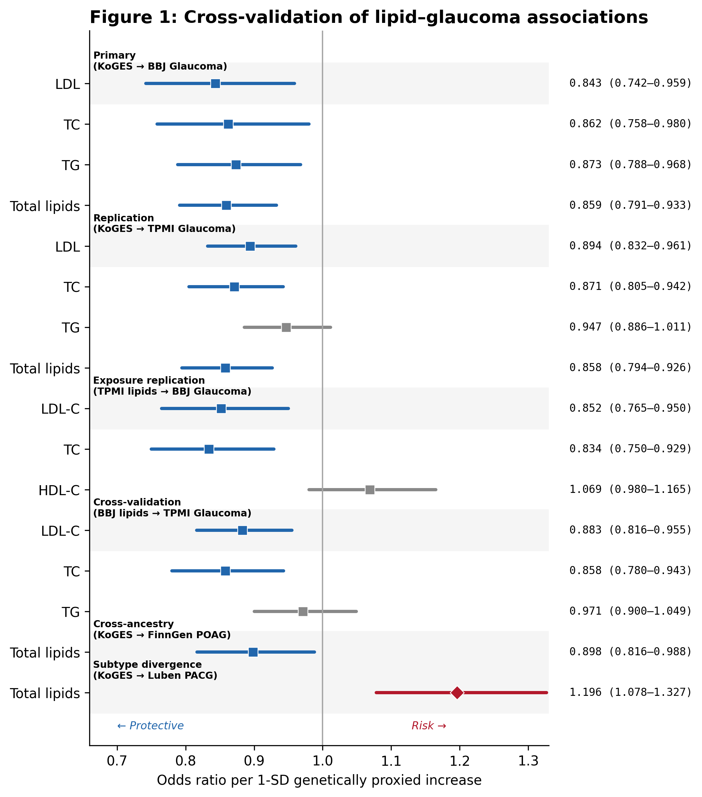
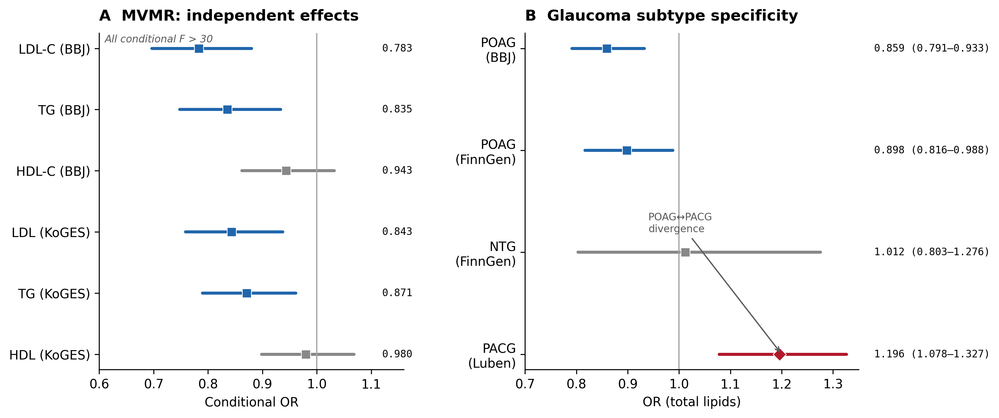

# lipid-glaucoma-mr-ea

Reproducibility code and result tables for an East Asian Mendelian randomization study of genetically proxied lipid levels and glaucoma risk.

This repository provides:

- runnable demo data for the core MR finding;
- analysis method modules for MR, MVMR, sensitivity analyses, FDR/consistency tests, drug-target MR, and protein MR;
- manuscript-reported v7 result CSVs;
- figure source data and rendered figures for visual inspection.

It is not a self-contained archive of all GWAS summary statistics. Full raw-data reruns require downloading the external GWAS summary statistics and LD reference panel listed in [`data/DATA_SOURCES.md`](data/DATA_SOURCES.md).

## Key figures

### Cross-validation of lipid-glaucoma associations



### Independent lipid effects and subtype specificity



## Quick start

```bash
pip install -r requirements.txt
cd demo
python test_all_modules.py
python run_demo.py
```

Expected test result:

```text
26 passed, 0 failed
```

The demo reproduces the core finding using a small real-data subset: KoGES total lipids to BBJ glaucoma.

## Repository structure

```text
.
├── code/          # Analysis method modules
├── data/          # External GWAS data source documentation
├── demo/          # Self-contained runnable demo
├── figures/       # Rendered manuscript and supplementary figures
├── output/        # Manuscript-reported result CSVs and figure source data
└── requirements.txt
```

## Reproduction levels

| Level | What is included | External data needed |
|---|---|---|
| Demo reproduction | Included demo TSVs and `demo/run_demo.py` | No |
| Method validation | `demo/test_all_modules.py` | No |
| Manuscript result inspection | v7 result CSVs and figure source data in `output/` | No |
| Full raw-data rerun | Method modules and data-source documentation | Yes |

## Output files

The `output/` directory contains:

- final manuscript result tables;
- supplementary table source CSVs;
- figure source CSVs;
- numeric/reference/output audit files.

See [`output/README.md`](output/README.md) for details.

## Citation

If you use this code or result tables, please cite the associated manuscript.
